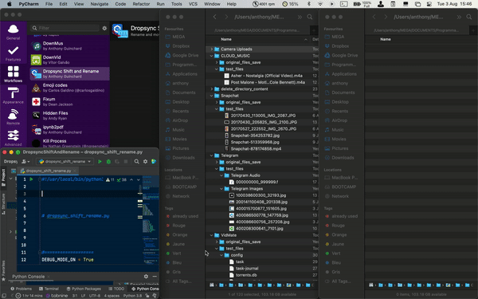

# dropsync_shift_rename.py
Python program that automatically renames, moves and eventually converts any
kind of files from the "DropsyncFiles" folder to the "Camera Uploads" folder.  

## Table of contents
* [1. Description](#1-description)
* [2. Getting started](#2-getting-started)
    * [2.1 Dependencies](#21-dependencies)
    * [2.2 Installing](#22-installing)
    * [2.3 Executing program](#23-executing-program)
* [3. Version history](#3-version-history)

<!-- toc -->

## 1. Description
`dropsync_shift_rename.py` is a Python program that allows you to easily rename,
centralize and eventually convert all files synchronized in the "DropsyncFiles"
folder to the "Camera Uploads" folder. 

## 2. Getting started

### 2.1 Dependencies
* Tested on macOS Big Sur version 11.4
* Python 3.8

### 2.2 Installing
`pip install -r requirements.txt`

### 2.3 Executing program
- To access useful help messages, type following Terminal command at the root of
  the project:
  
  `/usr/local/bin/python3.8 src/dropsync_shift_rename.py -h`

- To run the program, type following Terminal command at the root of the project:
  
  `/usr/local/bin/python3.8 src/dropsync_shift_rename.py`

Remark: with a Bash Terminal window, `/usr/local/bin/python3.8` can simply be
replaced by `python3.8`.

## 3. Version history
* 0.1
    * Initial release