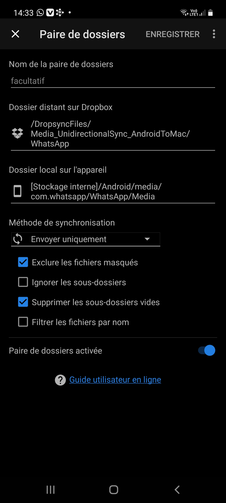

# dropsync_shift_rename.py
Python program that automatically renames, moves and eventually converts any
kind of files from the "DropsyncFiles" folder to the "Camera Uploads" folder.  

## Table of contents
* [1. Description](#1-description)
* [2. Getting started](#2-getting-started)
    * [2.1 Dependencies](#21-dependencies)
    * [2.2 Installing](#22-installing)
    * [2.3 Executing program](#23-executing-program)
* [3. Version history](#3-version-history)

<!-- toc -->

## 1. Description
`dropsync_shift_rename.py` is a Python program that allows you to easily rename,
centralize and eventually convert (e.g. from ".m4a" to ".mp3", from ".webp" to
".png", etc.) all files synchronized in the "DropsyncFiles" folder to the
"Camera Uploads" folder. 

  

Dropbox is certainly the most reliable file hosting service out there. This
application allows you to easily synchronise files such as pictures and text
files between different devices (computers, tablets, phones, etc.). Many users
utilize Dropbox to automatically upload their photos from their phone to their
computer. Although this solution is just ideal for iPhones, it is much less
useful for Android phones. In fact, for these devices, photos received from
WhatsApp conversations (for example) are not uploaded to the cloud. Indeed, only
the documents located in the `DCIM` directory (`/storage/emulated/0/DCIM`) of
the phone (i.e. photos and videos taken with the Android device, screenshots,
videocaptures, etc.) are synchronized with the Dropbox account. Unlike iPhones,
Android phones must therefore make use of a third-party application to
synchronise files from WhatsApp, Telegram, Snapchat, etc. An effective solution
is the [Dropsync Ultimate](https://play.google.com/store/apps/details?id=com.ttxapps.dropsync.pro&hl=en&gl=US)
Android app. This application allows to sync multiple pairs of folders between
the Android phone and the Dropbox account. As depicted in the image below, I
decided in my case to sync all documents from (for example) the WhatsApp,
Telegram and Snapchat folders on my Android phone.

  

The Python program `dropsync_shift_rename.py` allows to rename the synchronized
files in the the `DropsyncFiles` directory on the computer (among others by
adding their creation date) and to centralize them in the `Camera Uploads`
folder, where they are supposed to arrive in the case of an iPhone. It also
takes care of removing unwanted files that I don't want to store, such as photos
and videos that I have sent myself.

Remark: the `Dropsync Shift and Rename` Alfred workflow implements the `dropsync_shift_rename.py` Python program. After
  installing the [Alfred macOS app](https://www.alfredapp.com) and the `Dropsync Shift and Rename` workflow, simply type the `ds` hotkey in the Alfred search bar. The `dropsync_shift_rename.py` Python program is then
  automatically triggered and runs in iTerm2.

## 2. Getting started

### 2.1 Dependencies
* Tested on macOS Big Sur version 11.4
* Python 3.8

### 2.2 Installing
`pip install -r requirements.txt`

### 2.3 Executing program
- To access useful help messages, type following Terminal command at the root of
  the project:
  
  `/usr/local/bin/python3.8 src/dropsync_shift_rename.py -h`

- To use the program, adapt the path constants `DROPSYNCFILES_DIRECTORY_PATH`
and `CAMERA_UPLOADS_DIRECTORY_PATH` defined at the beginning of the code. Then,
to run the program, type following Terminal command at the root of the project:
  
  `/usr/local/bin/python3.8 src/dropsync_shift_rename.py`

Remark: with a Bash Terminal window, `/usr/local/bin/python3.8` can simply be
replaced by `python3.8`.

## 3. Version history
* 0.1
    * Initial release